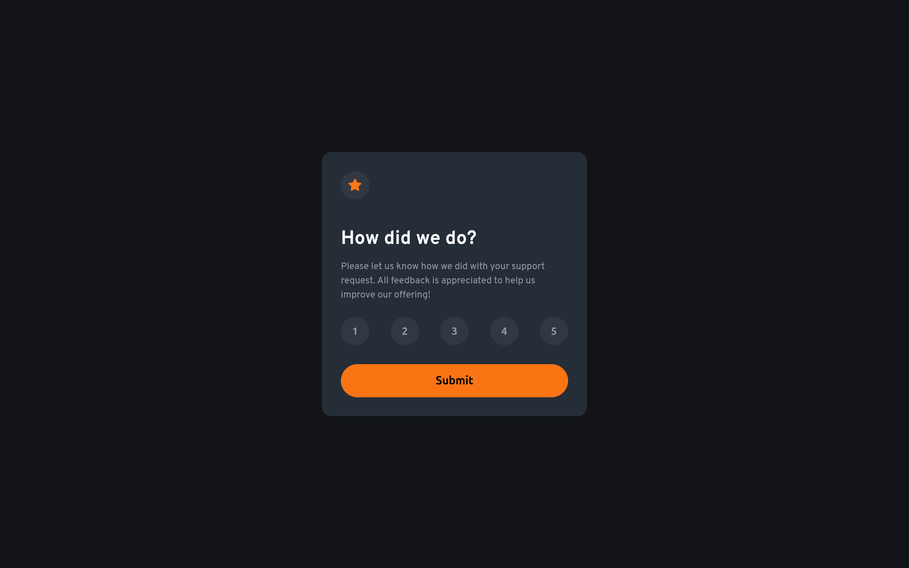
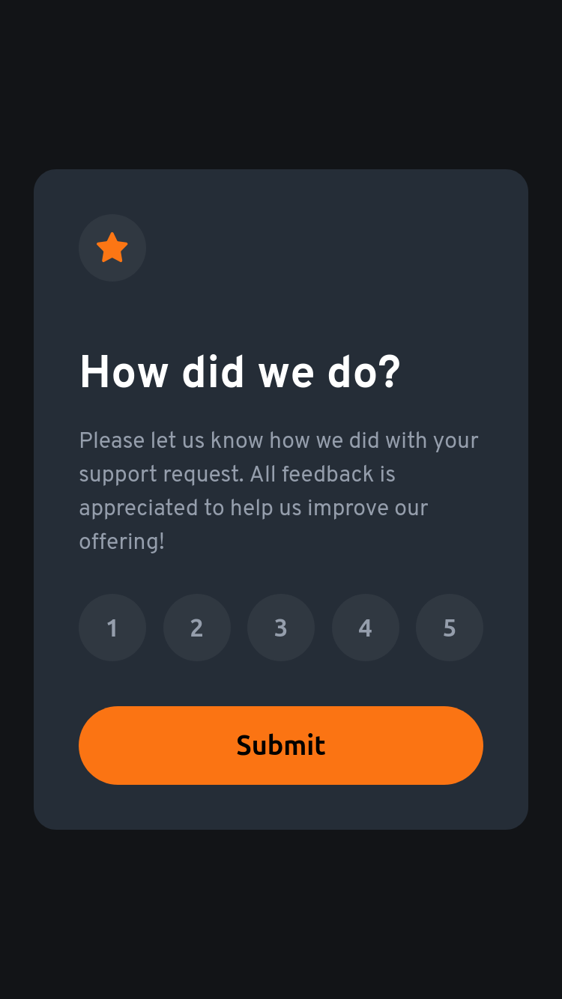

# Frontend Mentor - Interactive rating component solution

This is a solution to the [Interactive rating component challenge on Frontend Mentor](https://www.frontendmentor.io/challenges/interactive-rating-component-koxpeBUmI). Frontend Mentor challenges help you improve your coding skills by building realistic projects. 

## Table of contents

- [Overview](#overview)
  - [The challenge](#the-challenge)
  - [Screenshot](#screenshot)
  - [Links](#links)
- [My process](#my-process)
  - [Built with](#built-with)
- [Author](#author)

## Overview

### The challenge

Users should be able to:

- View the optimal layout for the app depending on their device's screen size
- See hover states for all interactive elements on the page
- Select and submit a number rating
- See the "Thank you" card state after submitting a rating

### Screenshot

### Links

- [Solution Repo (code)](https://github.com/IbrahimMurad/interactive-rating-component)
- [Live Site](https://ibrahimmurad.github.io/interactive-rating-component/)

## My process

### Built with

- Semantic HTML5 markup
- CSS custom properties
- Flexbox
- CSS Grid
- Mobile-first workflow
- Vanilla JavaScript
- Sass

## Author

- [Email](mailto:ibrahimmorad31@gmail.com)
- [LinkedIn](https://www.linkedin.com/in/ibrahim-morad-228410209/)
- [Frontend Mentor](https://www.frontendmentor.io/profile/IbrahimMurad)
- [Github](https://github.com/ibrahimmurad/)
- [Discord](https://discord.com/users/ibrahimmorad)